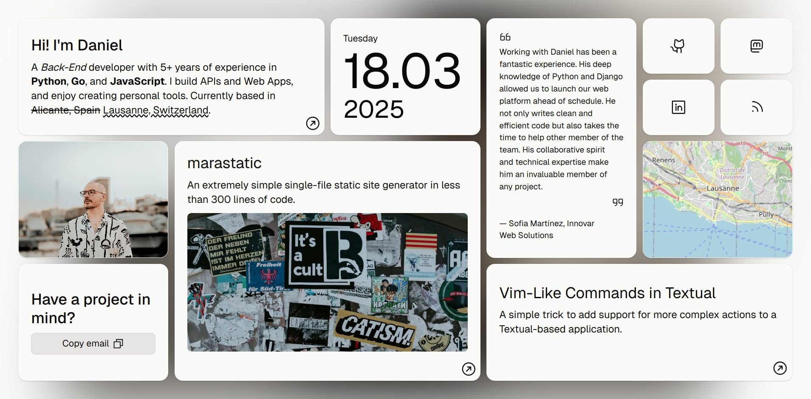

# Personal portfolio - dnlzrgz

This is my personal portfolio, designed to showcase my projects, and experience, as well as a platform for publishing my thoughts. The site has been built using [marastatic](https://github.com/dnlzrgz/marastatic), a single-file static site generator created by me, along with [Tailwind CSS](https://tailwindcss.com) and a bit of JavaScript via [Alpine.js](https://alpinejs.dev), [quicklink](https://github.com/GoogleChromeLabs/quicklink) and [leaflet](https://leafletjs.com). The icons are from [Phosphor](https://phosphoricons.com) and the fonts used are from [Geist fonts](https://vercel.com/font).

## Features

⚡️ Content is just a bunch of Markdown files.  
⚡️ Jinja2 templating.  
⚡️ Extremely fast.  
⚡️ Simple to maintain.  
⚡️ Easily to extend.  
⚡️ Responsive design.  
⚡️ Supports dark mode.  
⚡️ Support for modern SEO techniques like structure data.  
⚡️ No loss of basic functionality when JavaScript is disabled.

## About the project

As stated in the `marastatic` repository, the objective of this project is to be extremely simple. As a result, many functionalities have been delegated to other tools, such as the Tailwind CSS' CLI for managing styles and the `cwebp` CLI for converting images to `.webp` format. While this may not be the most optimal workflow, it works well for me. However, if this approach doesn't meet your needs, remember that `marastatic` is just a Python script that you can adapt and extend as much as you like.
