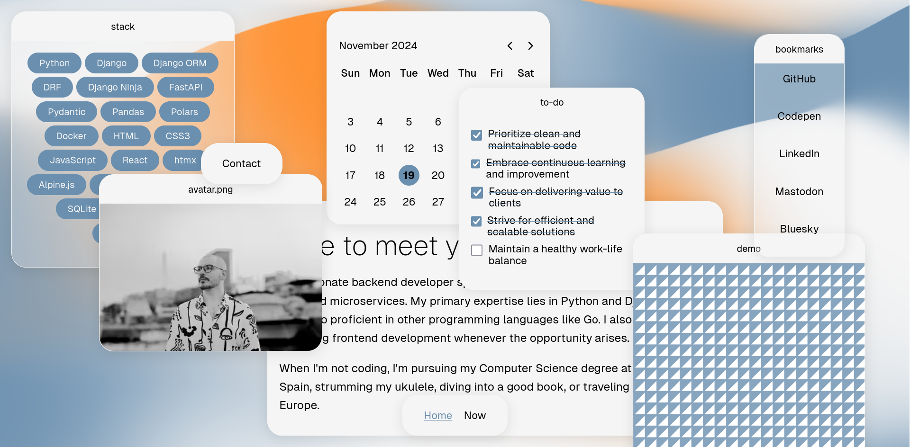

# dnlzrgz.com

A simple and fast OS-like portfolio made with Django, Wagtail, some pure CSS and a bit of JavaScript with almost no build process.

## Features

- 📜 Statically generated thanks to [`wagtail-bakery`](https://github.com/wagtail-nest/wagtail-bakery) and [`django-bakery`](https://github.com/palewire/django-bakery).
- 💡 Dark/light themes.
- ⚡ Responsive styles.
- 🪶 Ready for blogging.
- 📤 RSS feed.
- 🌱 SEO-friendly URLs, meta tags, LD+JSON and sitemap generation.
- 📦 Easy to deploy on AWS or platforms such as Cloudflare pages.
- ⚙️ Configurable via env variables.

## Toolbox

- [Wagtail](https://wagtail.org/)
- [Django](https://www.djangoproject.com/)
- [`wagtail-bakery`](https://github.com/wagtail-nest/wagtail-bakery)
- [`django-bakery`](https://github.com/palewire/django-bakery)
- Pure CSS
- Vanilla JavaScript
- [p5.js](https://p5js.org)
- [Geist fonts by Vercel](https://vercel.com/font)
- [Geist icons by Vercel](https://geist-ui.dev/en-us/components/icons)

## License

1. You are free to use this code as inspiration.
2. Please do not copy it directly.
3. Crediting the author is appreciated.
