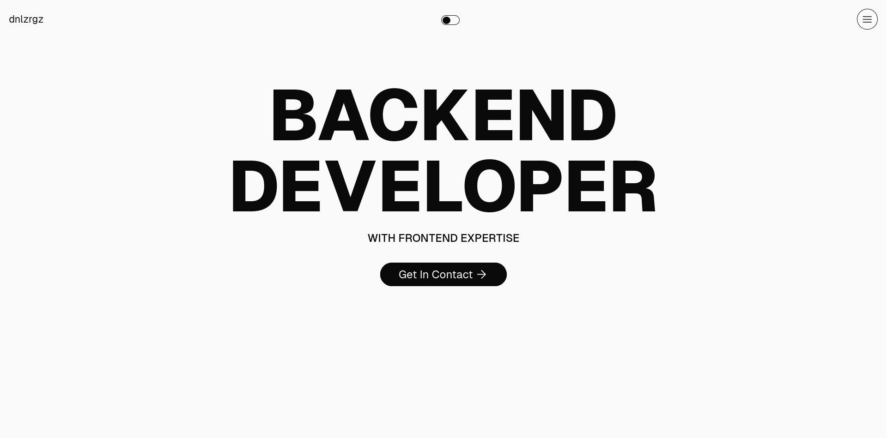

# dnlzrgz.com

> A simple and fast portfolio made with Django, Wagtail, some CSS and a bit of JavaScript.

## Features

- 💡 Dark/light themes.
- ⚡ Responsive styles.
- 🪶 Ready for blogging.
- 📤 RSS feed.
- 🌱 SEO-friendly URLs, meta tags, and sitemap generation.
- 🚀 Performance optimizations like lazy loading for images by default.
- ⚡️ Lightning-fast performance.
- 💥 Support for front-end cache management.
- 📦 Docker support for easier deployment and scalability.
- ☁️ Optional support for AWS S3 (you'll need to install `django-storages[s3]` first).
- 🔒 Advanced security features, such as IP blacklisting.
- ⚙️ Configurable via env variables.

## Toolbox

- [Wagtail](https://wagtail.org/)
- [Django](https://www.djangoproject.com/)
- Pure CSS.
- Vanilla JavaScript.
- [Geist fonts by Vercel](https://vercel.com/font)
- [Geist icons by Vercel](https://geist-ui.dev/en-us/components/icons)

## License

1. You are free to use this code as inspiration.
2. Please do not copy it directly.
3. Crediting the author is appreciated.
